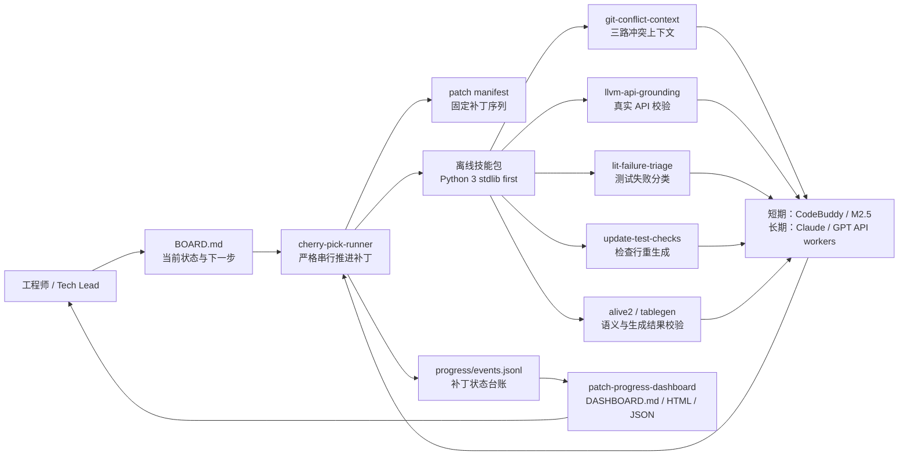
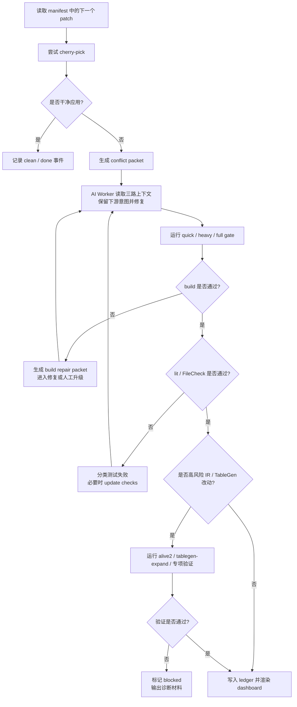
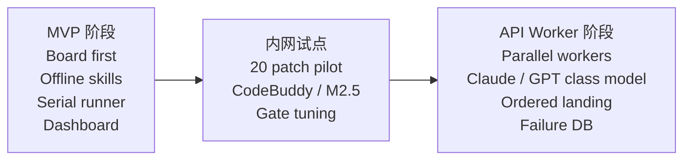
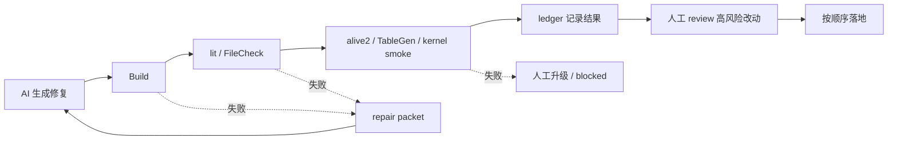

# AI Agent 驱动 LLVM 升级：从“会聊天的助手”到“可验证的工程流水线”

这份文档用于向领导和同事介绍当前 LLVM Upgrade Agent MVP 的定位、价值和落地方式。它不是在宣传一个“自动写完所有代码”的黑盒，而是在展示一种更可靠的工程组织方式：让 AI Agent 在明确规则、离线技能、真实工具和强验证闸口下，把 LLVM 19 到 LLVM 22 的升级工作拆成可执行、可追踪、可复盘的任务流。

## 一句话总结

我们要做的不是让 AI “凭感觉合代码”，而是把 AI 放进一个严谨的工程回路里：

- `cherry-pick-runner` 负责按顺序推进补丁。
- 离线技能负责收集真实上下文、校验 LLVM API、分析 lit 失败、生成修复包。
- AI Agent 负责理解冲突意图、提出修复、调用工具、接受测试反馈并迭代。
- ledger 和 dashboard 负责记录每个补丁的状态，让人随时知道进度、风险和卡点。

这就是 AI Agent 的魅力：它不是替代工程事实，而是把工程事实组织成一个能持续行动的系统。

## 为什么 LLVM 升级适合 Agent

LLVM 19 到 22 的升级不是一个单点改动，而是一长串小而复杂的工程判断：API 改名、Pass Manager 变化、TableGen 展开、lit 检查更新、后端 lowering 语义、潜在 silent miscompile。传统做法主要依赖工程师不断切上下文、手工查历史、手工跑测试、手工记录状态。

Agent 的价值在于把这些重复但高认知负担的动作标准化：

| 工作环节 | 传统方式 | Agent 化之后 |
|---|---|---|
| 冲突定位 | 人肉读 conflict marker | 自动生成 base / ours / theirs 三路上下文 |
| API 判断 | 凭经验或搜索记忆 | 强制在 LLVM 22 源码里 grounding |
| lit 失败 | 手工看 FileCheck 输出 | 自动分类 text drift / semantic regression / downstream break |
| 测试更新 | 人判断是否能重生成 | 自动识别 update-test-checks 适用条件 |
| 进度同步 | 会议和口头同步 | JSONL ledger + dashboard 实时呈现 |
| 风险拦截 | 事后 review | build / lit / alive2 / TableGen / kernel test 分层 gate |

## 当前 MVP 已经具备什么

当前仓库提供的是一个可搬进内网的 MVP skill pack，而不是完整自治机器人。它的边界很清楚：

- 所有技能自包含在 `skills/<skill-name>/` 下。
- helper 脚本优先使用 Python 3 标准库。
- 短期用 CodeBuddy / MiniMax M2.5 做交互式语义修复。
- 长期保留同一套状态机和技能，替换为 Claude / GPT 级 API worker。
- 每个补丁的推进以 ledger 为准，dashboard 只读取事实并渲染。

当前核心组件：

- `cherry-pick-runner`：严格串行推进补丁，支持 dry-run、manifest、hybrid gate 和 repair packet。
- `git-conflict-context`：把冲突文件的三路内容和相关 commit 信息整理成 AI 可读包。
- `llvm-api-grounding`：在真实 LLVM 22 源码中确认 API、header 和调用示例。
- `lit-failure-triage`：分类 lit / FileCheck 失败，避免把合理输出变化误当 bug。
- `update-test-checks`：封装 LLVM 官方测试更新脚本。
- `alive2-verify`：对 IR transformation 类风险做等价验证。
- `tablegen-expand`：在修改 `.td` 前查看真实展开结果。
- `downstream-patch-ledger`：记录下游补丁状态、意图和处理结果。
- `patch-progress-dashboard`：从事件日志和 worker heartbeat 渲染 Markdown / HTML / JSON 进度视图。

## 总体架构



这个架构的重点不是“模型有多聪明”，而是模型永远在一个有边界的执行系统里工作：

1. 输入来自真实仓库、真实 diff、真实 build/test 输出。
2. 输出必须回到 git、build、lit、alive2、ledger 里验证。
3. 状态写入进度文件，不靠聊天窗口记忆。
4. 失败时生成 repair packet 或人工升级，不假装成功。

## 一个补丁的生命周期



这条流程体现了 Agent 和普通脚本的区别：

- 脚本擅长固定动作，但遇到语义冲突会停住。
- 人擅长判断，但不适合长时间重复搬运上下文。
- Agent 处在两者之间：它可以读上下文、做判断、调用脚本、接受失败反馈，再继续迭代。

## AI Agent 的真正魅力

### 1. 它把“知识”变成可执行工具

普通 AI 问答会说“你应该检查 LLVM API 是否变化”。Agent 化之后，这句话变成 `llvm-api-grounding`：输入符号名，输出真实 header、签名和调用点。模型不再靠记忆猜 API，而是必须回到源码里确认。

### 2. 它把“经验”变成固定流程

有经验的 LLVM 工程师知道，lit 失败不一定是代码错，可能只是上游输出文本变化。Agent 化之后，这个经验被固化成 `lit-failure-triage`：先看是否 autogen，再跑 `--dump-input=always`，再判断是 text drift、semantic regression 还是 downstream break。

### 3. 它把“进度”变成可观察事实

大型升级最怕的不是某个冲突难，而是大家不知道还剩多少、卡在哪里、哪些问题反复出现。ledger-first dashboard 把每个 patch 的状态写成事件日志，dashboard 只是读取事实。这样领导看的是燃尽图和风险分布，同事看的是下一步要处理的具体 patch。

### 4. 它让人机分工更清楚

Agent 适合做：

- 批量上下文整理。
- 机械 API 迁移。
- 构建和测试失败的第一轮分析。
- 生成 repair packet。
- 维护 ledger 和 dashboard。

人仍然负责：

- 下游语义是否应该保留。
- TableGen、CodeGen、DebugInfo、sanitizer 等高风险改动 review。
- silent miscompile 风险判断。
- 最终分支策略和 release 取舍。

这不是“人被替代”，而是人从重复查找和粘贴上下文中解放出来，回到真正需要判断力的位置。

## 短期和长期的演进路径



短期我们不假设 MiniMax M2.5 有 API，也不把 CodeBuddy 当成无人值守机器人。短期合理做法是：本地 runner 和技能生成精确 packet，人把 packet 交给 CodeBuddy / M2.5 做局部语义修复，再回到 runner 验证。

长期如果接入 Claude / GPT 级 API worker，不需要推翻架构，只需要把“人工粘贴 packet”替换成“API worker 接收 packet 并返回 patch”。这就是当前 MVP 设计最重要的可延续性。

## 为什么要强调验证，而不是只强调生成

LLVM 后端升级最大的风险不是编不过，而是 silent miscompile：代码看起来对，测试也可能局部通过，但实际生成了错误代码。因此 Agent 的价值必须绑定验证体系，而不是只看它生成了多少行代码。

推荐的验证层次：

| 验证层 | 目标 | 适用场景 |
|---|---|---|
| build gate | 保证能编译 | 每个 patch |
| lit / FileCheck | 捕获 IR / asm 输出变化 | 测试相关 patch |
| update-test-checks diff | 区分合理文本漂移和真实回归 | autogen 测试 |
| tablegen-expand | 防止 `.td` 修改只看表面 | TableGen patch |
| alive2 | 检查 IR transformation 等价性 | 优化 pass / IR 改动 |
| GPU kernel smoke | 验证真实设备路径 | 后端 lowering / runtime |
| fuzzing / bootstrap | 捕获深层 silent miscompile | 里程碑验证 |



一句话：没有验证的 AI 只是更快地产生不确定性；有验证的 Agent 才是工程加速器。

## 给领导看的价值

1. **进度可见**：dashboard 把总补丁数、已完成、冲突、阻塞、测试失败和 worker 状态变成可看板化数据。
2. **风险前置**：高风险类别在流程中被标记，TableGen / CodeGen / IR 优化不会被当成普通文本冲突处理。
3. **资产沉淀**：每次冲突、失败和修复都会进入 ledger / packet / failure DB，下次升级可以复用。
4. **内网可落地**：技能包不依赖网络服务，脚本优先 Python 3 标准库，适合搬进受限环境。
5. **模型可替换**：短期用 CodeBuddy / M2.5，长期可接 Claude / GPT API worker，业务流程不重写。

## 给同事看的使用方式

日常工作可以按这个节奏理解：

1. 先读 `BOARD.md`，确认当前阶段和待办。
2. 用 `docs/claude-preflight.md` 准备 LLVM19 / LLVM22 / skills 路径。
3. 用 `cherry-pick-runner` 生成 manifest、runner config，并 dry-run 检查前 20 个 patch。
4. 真正运行时一次只推进有限数量 patch。
5. 遇到冲突时，不直接靠肉眼处理，而是先生成 conflict packet。
6. 对 API、lit、TableGen、IR 风险分别调用对应技能。
7. 每次处理结果写入 ledger，dashboard 渲染给团队同步。

最小验证命令：

```bash
python3 tests/test_skill_pack.py
```

导入技能包的基本方式：

```bash
cp -R skills/* "$CODEX_HOME/skills/"
```

## 适合分享时展示的 10 分钟讲法

1. **第 1 分钟：问题规模**
   LLVM 19 到 22 不是一次 API rename，而是一条长补丁链，风险包含冲突、测试漂移和 silent miscompile。

2. **第 2-3 分钟：Agent 不是聊天机器人**
   展示“总体架构”图，说明 Agent 会读仓库、调用工具、跑验证、写状态。

3. **第 4-5 分钟：单个 patch 生命周期**
   展示生命周期图，说明 clean patch 自动推进，冲突进入 packet，失败进入 repair loop。

4. **第 6-7 分钟：AI 的魅力**
   重点讲知识工具化、经验流程化、进度事实化、人机分工清晰。

5. **第 8 分钟：质量闸口**
   强调 build/lit/alive2/TableGen/GPU kernel，不让 AI 自己宣布成功。

6. **第 9 分钟：短期可用，长期可升级**
   当前 CodeBuddy / M2.5 能做短期交互 worker；未来接 Claude / GPT API worker 不改核心流程。

7. **第 10 分钟：下一步**
   选择 20 个代表性下游 patch 做 pilot，用真实数据衡量成功率、升级成本和风险分布。

## 建议的下一步

先不要追求“一口气跑完整个 LLVM 19 到 22”。最务实的下一步是做 20 patch pilot：

- 覆盖 IR pass、backend lowering、TableGen、driver/build、lit test 五类场景。
- 每类记录成功率、失败原因、是否缺技能、是否需要人工 review。
- 用 dashboard 展示每天 burn-down 和阻塞类型。
- 根据 pilot 结果决定是否扩展到 50 / 300 / 全量 patch。

这条路线能让团队用一两周看到真实收益，而不是先投入数月搭一个假定正确的大系统。

## 结语

AI Agent 最有魅力的地方，不是它能写出一段看似聪明的答案，而是它能在复杂工程中持续行动：读上下文、用工具、做判断、跑验证、记录状态、遇到不确定性时升级给人。

LLVM 升级正好是这种能力的典型场景。只要我们把 Agent 放在明确边界、真实工具和强验证体系里，它就不只是一个“助手”，而会变成团队的工程放大器。
